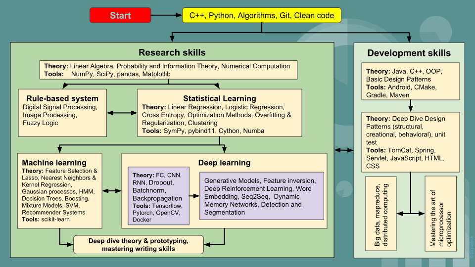

# Machine Learning cheatsheets

# The Big Picture in Research.

# [**Introduction**](01_Introduction.md)

# **Get started**

1. [C++](https://www.notion.so/ideasbox/C-612821ddaa2b4f59b14ac93a7cbcf928)
2. [Python](https://www.notion.so/ideasbox/Python-e602ce66477642c9b5b245704e6cd386)
3. [Algorithms](https://www.notion.so/ideasbox/Algorithms-5624a4c3ba124151a66b5dba1944de76)
4. [Git](https://www.notion.so/ideasbox/Git-5fedcde8e0724758acf03dba9f20e55c)
5. [Clean code](https://www.notion.so/ideasbox/Clean-Code-1528cf41e0ce4a4cace7f1081e2336c6)

# **Developer skills**

1. Java [TODO]
2. [C++](https://www.notion.so/ideasbox/C-612821ddaa2b4f59b14ac93a7cbcf928)
3. OOP [TODO]
4. [Basic Design Patterns](https://www.notion.so/ideasbox/Basic-Design-Patterns-60543b66501443b68ed952028d9ebed8)
5. [Android](https://www.notion.so/ideasbox/Android-8e776458c7024f06b5552290c34f2391)
6. CMake [TODO]
7. Gradle [TODO]
8. Maven [TODO]
9. [Deep Dive  Design Patterns](https://www.notion.so/ideasbox/Deep-Dive-Design-Patterns-2177fec1095e4503aa6bcdd690dc861b)
10. Unit test [TODO]
11. TomCat [TODO]
12. Spring [TODO]
13. JavaScript [TODO]
14. HTML [TODO]
15. CSS [TODO]
16. [Big Data Engineer Path](https://www.notion.so/ideasbox/Big-Data-Engineer-Path-b072c0a9de0f4cbea9feeba97b48032a)

# **Research skills**

1. **Get started research** [TODO]
    - [Linear Algebra](https://www.notion.so/ideasbox/Linear-Algebra-26c6fe5dc62545658664a0419c2f2f77)
    - [Probability and Information Theory](https://www.notion.so/ideasbox/Probability-and-Information-Theory-a67ec2ba7a904f31bf1efce4f3ec509c)
    - [Numerical Computation](https://www.notion.so/ideasbox/Numerical-Computation-a0f5bd83d1fe4589918c609e43c63ccd)
2. **Rule Base System** [TODO]
    - [Digital Signal Processing](https://www.notion.so/ideasbox/Digital-Signal-Processing-58243d25e39b4aa7a2307272b9341fd0)
    - [Image Processing](https://www.notion.so/ideasbox/Image-Processing-f18d47416d744a51b4de874c9565cf11)
    - [Fuzzy Logic](https://www.notion.so/ideasbox/Fuzzy-Logic-c371692f3cfb4d10818669c0244b7115)
3. **Statistical machine learning** [TODO]
    - [Linear Regression](https://www.notion.so/ideasbox/Linear-Regression-5a63eea8cb6440a89d51d19695803e29)
    - [Logistic Regression](https://www.notion.so/ideasbox/Logistic-Regression-a83ff3aa5ea440f880476943a91b51dc)
    - [Cross Entropy](https://www.notion.so/ideasbox/Cross-Entropy-80287c6613ff417faf8de71c1a32fa81)
    - [Optimization Methods](https://www.notion.so/ideasbox/SGD-f6a694af47f94217a16d6950fd9813a1)
    - [Overfitting & Regularization](https://www.notion.so/ideasbox/Overfitting-Regularization-24cbafcaee6645ec92352d53f341cea6)
    - [Clustering](https://www.notion.so/ideasbox/Clustering-e5d21188bd6f4a269bf630c645f84577)
    - [pybind11](https://www.notion.so/ideasbox/pybind11-69977e341d8c4696a069a9eb21808b69)
    - [Tensorflow](https://www.notion.so/ideasbox/Tensorflow-de4d05fac8c4401fa4aeb52a444e1805)
4. **Machine Learning** [TODO]
    - [Feature Selection & Lasso](https://www.notion.so/ideasbox/Feature-Selection-Lasso-79139d52b381465cab0ebd89eeb65bc4)
    - [Nearest Neighbors & Kernel Regression](https://www.notion.so/ideasbox/Nearest-Neighbors-Kernel-Regression-7754d003103c40a98bcf2b1808309082)
    - [Gaussian processes](https://www.notion.so/ideasbox/Gaussian-processes-1b712076a512406da12c676df5c5962e)
    - [Graphical model](https://www.notion.so/ideasbox/Graphical-model-e9d73058accb42fb934039143c144498)
    - [Hidden Markov Model](https://www.notion.so/ideasbox/Hidden-Markov-Model-8e55ce3cbf0c4827a8f39f1c2f329ae2)
    - [Decision Trees, Boosting](https://www.notion.so/ideasbox/Decision-Trees-Boosting-8a29e60e78704938b68cbf296638fdfb)
    - [Mixture Models](https://www.notion.so/ideasbox/Mixture-Models-3260e541958c4bec8c66798756ea2d79)
    - [Support Vector Machines](https://www.notion.so/ideasbox/Support-Vector-Machines-c66b03de8b4a49dca568c8ca673ec370) (SVM)
    - [Recommender Systems](https://www.notion.so/ideasbox/Recommender-Systems-89c0649c74cb41d98e01f7e1a3946879)
5. **Deep Learning** [TODO]
    - [FC, CNN, RNN, Dropout, Batchnorm, Backpropagation](https://www.notion.so/ideasbox/FC-CNN-RNN-Dropout-Batchnorm-Backpropagation-551bb47095574574a4162c09c983ec58)
    - [Generative Models](https://www.notion.so/ideasbox/Generative-Models-4da6d064b02f41fda3a32facf32d22ec)
    - [Feature inversion](https://www.notion.so/ideasbox/Feature-inversion-aa91ef2235bd482aa21f19e6c4b96af2)
    - [Deep Reinforcement Learning](https://www.notion.so/ideasbox/Deep-Reinforcement-Learning-75e649a8239e4cdbbcb695fce9340ee1)
    - [Word Embedding](https://www.notion.so/ideasbox/Word-Embedding-ee311c03c74b416c99cea5cde8ca40b1)
    - [Seq2Seq](https://www.notion.so/ideasbox/Seq2Seq-d0220eef3495471daad385f92beac538)
    - [Dynamic Memory Network](https://www.notion.so/ideasbox/Dynamic-Memory-Network-32b59e03def54506a0406d053b22e09f)
    - [Detection and Segmentation](https://www.notion.so/ideasbox/Detection-and-Segmentation-407e17ab92e34afa80ad6dd6d82d9365)
    - [Bayesian deep learning](https://www.notion.so/ideasbox/Bayesian-deep-learning-a900bc1a1afa4fe4aeed5c41bc93239e)
